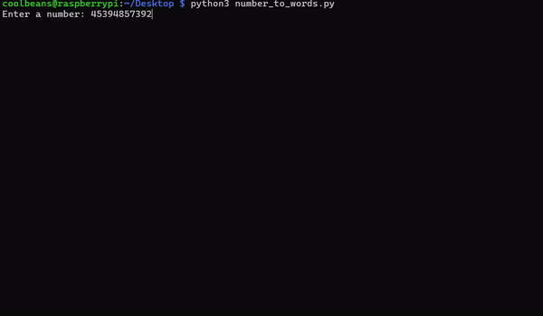

# Number to Words Converter
<div style="display: flex; gap: 10px;">   
    
</div>
This Python project converts numbers into their word equivalents, capable of handling very large numbers up to Millinillion! 

## Features

- Converts numbers to words
- Handles large numbers up to millinillion
- Formats numbers with commas for readability
- Optional: Uses `gtts` to read the numbers aloud

## Getting Started

### Prerequisites

- Python 3.x
- Optional: `gtts` and `mpg321` for text-to-speech functionality

### Installation

1. Clone the repository:

   ```bash
   git clone https://github.com/frogCaller/number-to-words.git
   cd number-to-words
   
2. Create a virtual environment for text-to-speech functionality:
   ```
   python3 -m venv speech_env
   source speech_env/bin/activate
   pip install gTTS
   pip install mpyg321
   ```
## Usage
### Run the script:
- python3 number_to_words.py
- Enter the number you want to convert when prompted.

### Example:
Enter a number: 123456789

### Output:

- 123,456,789

- one hundred twenty-three million four hundred fifty-six thousand seven hundred eighty-nine

## File Structure
- number_to_words.py: Main script that performs the number to words conversion.
- scale.txt: File containing scale words (thousand, million, etc.).

## Support the project
If you would like to support this project and and keep me caffeinated, you can do it here:

[](https://www.buymeacoffee.com/tonysacco)
